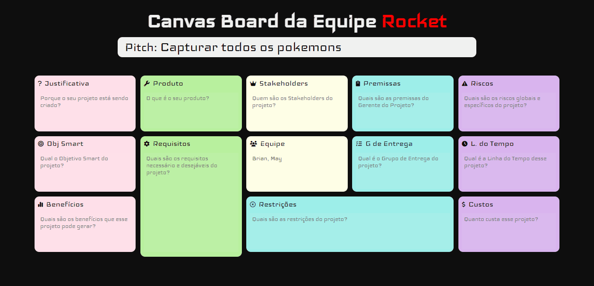

# Project Model Canvas

### Projeto pessoal de um quadro de PMC, para planejar um projeto
## Sobre o projeto

Ambiente para fazer o planejamento do seu projeto dentro da Project Model Canvas 

Próximas etapas:
- Responsividade
## Tecnologias Usadas até o momento

Para completar o desafio usei:
 - HTML
 - CSS
 - Tags Semânticas
 - Javascript
 - Manipulação do DOM

 
## O Projeto Rodando

#### Versão Desktop
